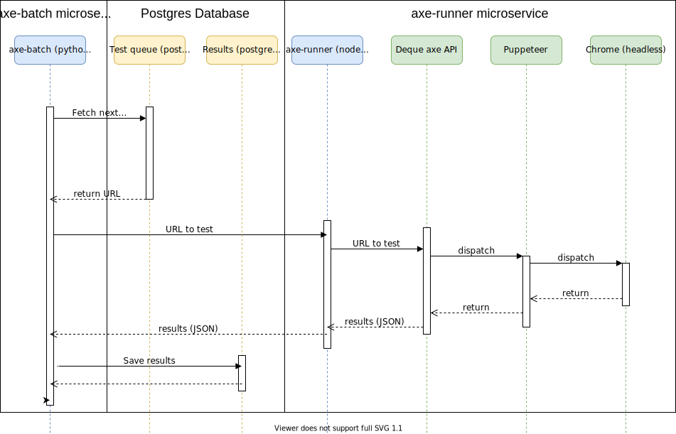

# How we use Deque axe

[Deque Axe](https://github.com/dequelabs) is a suite of open-source tools for testing the accessibility of the website at the supplied URL against a set of standard metrics, aligned to the current WCAG rules/guidelines.

Its primary use is to be integrated into a Continuous Integration/Continuous Deployment pipeline in order to automatically test a website that the user is developing.

Our use-case is somewhat different in that we need to test _external_ websites automatically, in a batch process running on [GOV.UK PaaS](https://www.cloud.service.gov.uk/); we don't have access to that pipeline.

Having said that, the axe-core runs against any URL that is accessible from the computer that is running it - so that's any publicly accessible website.

## Architecture
There are two principal microservices involved so far:
* axe-batch
* axe-Runner

In addition, there is a postgres database running as a service, containing two schema:
* __pubsecdomains__ - contains all known (so far) domain names that belong to public sector organisations, together with supporting tables such as categories, sectors, geographical regions.
* __a11ymon__ - contains the results of all testing done by the accessibility monitoring team, together with supporting tables such as axe error codes/types, WCAG rules.

The database is administered either remotely via conduit or using an instance of pgadmin hosted in the same organisational space of PaaS.

The whole system is hosted within [GOV.UK PaaS](https://www.cloud.service.gov.uk/) which provides security and load-balancing functions.

### axe-Runner
This is a node.js script that wraps around the axe API and Google's Puppeteer.  
It takes as its input a single URL, and directs Puppeteer to that URL then injects the axe code into the website it finds and runs it, then returns the result.

* Input: A single URL.
* Output: JSON test results from axe, wrapped in custom JSON for reporting related information / errors.

### axe-batch
This is a python script that reads URLs from a postgres database, feeds them to axe-runner one at a time and processes the returned result, storing it as appropriate in a second postgres database.

## Sequence Diagram

# Development history; reasoning for design decisions

## First forays

Initially we used the [axe command line interface (CLI)](https://github.com/dequelabs/axe-cli) to generate machine-readable reports (in JSON).   
We were able to create a shell script to run this as a batch process, and feed it a number of candidate websites.

However, this was far from ideal; error-trapping was virtually non-existent and the whole thing felt very "kludgy".   
It was certainly not scalable.

We then moved to calling the CLI from a python script.  
This facilitated reading candidates from our Public Sector Domains database and writing results to a test results database.

However, shelling a CLI is also less than ideal for similar reasons.

Enter [axe webdriverjs](https://github.com/dequelabs/axe-webdriverjs).

## Webdriver + Selenium

The axe webdriver is a node library that "provides a chainable aXe API for Selenium's WebDriverJS and automatically injects into all frames."

[Selenium](https://www.selenium.dev/) is a popular suite of tools for automating browsers. It is commonly used for automated testing of websites.   
[Selenium webdriver](https://www.selenium.dev/projects/) "drives a browser natively, as a real user would, either locally or on remote machines."

We set up a script that passed axe via Selenium into a Chrome browser.    
That worked fine on a local (MacOS) machine, but to do it unattended requires a headless version of the browser (ie one which doesn't have any of the stuff that looks after actually displaying pages - there's nothing to display them on!). Fortunately Chrome does indeed have a headless mode.   
It also has a gazillion settings and options.

It took a considerable amount of fiddling to get this to work. The main issue is that, because our script interfaces indirectly with the headless Chrome via Selenium, debug information was virtually non-existent; we were left with the age-old art of trial-and-error.  
It worked, eventually.   
Next step: get it to work in Cloud Foundry (ie PaaS).

On MacOs, Chrome - and its headless mode - is easily installed in a standard location, and Selenium knows where it is.    
But an application environment set up in Cloud Foundry only has what you explicitly give it - we had to find a way to install Chrome.

We settled on installing it as an APT using the [Cloud Foundry Experimental Apt buildpack](https://github.com/cloudfoundry/apt-buildpack.git).   
And then we had to find and install all of its dependencies by running it, checking the logs to see which dependency gap caused it to fail, installing the missing dependency then running it again to find the next one.  
There were nearly 40 in all.

And still it didn't work.

The cause was simply that it wasn't being installed where Selenium expected it. There is no way to tell Selenium where to find Chrome (there's a way to give it the path to chromium-driver, but that's not the same as the actual browser).

There is, in fact, a way around this using some shell scripting and fairly esoteric Cloud Foundry shenanigans, but this was getting more and more complex - and complexity makes a thing far harder to maintain.  That combined with the long list of dependencies (what would happen if the latest Chrome required another dependency?) was reason enough to find a third way...

## Pulling strings
The Chrome DevTools team have created a marvellous thing called [Puppeteer](https://pptr.dev/):
> Puppeteer is a Node library which provides a high-level API to control Chrome or Chromium over the DevTools Protocol. Puppeteer runs headless by default

With this, we could remove the complexity - and obfuscation - of accessing Chrome through Selenium and pull the strings of Chrome (nearly) directly.

Better still, Deque have kindly supplied [axe-puppetteer](https://github.com/dequelabs/axe-puppeteer), "a chainable axe API for Puppeteer that automatically injects axe into all frames."   
This is what the latest incarnation of our axe batch process is based on.

If only we'd found it before...
